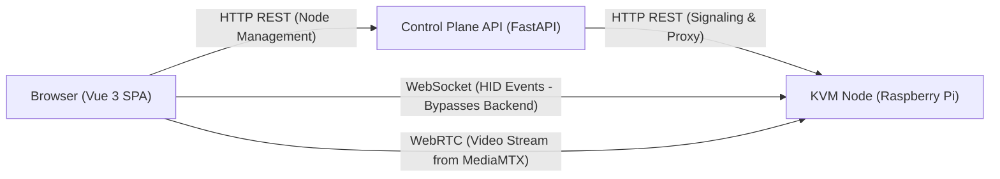

# IP-KVM Control Plane


A modern web-based control plane for managing a fleet of Raspberry Pi-based IP-KVM devices. It provides a centralized dashboard for connecting to KVM nodes via low-latency WebRTC streams, monitoring device status, and managing hardware configurations.

## Architecture

The system consists of a web frontend, a central backend control plane, and distributed KVM nodes (Raspberry Pi devices).



### Communication Channels
- **HTTP REST**: Used for node management, user authentication, and WebRTC signaling between the frontend, backend API, and KVM nodes.
- **WebSocket**: Direct low-latency connection from the browser to the KVM node for real-time HID (keyboard and mouse) events, bypassing the backend.
- **WebRTC**: Low-latency video stream sent directly from MediaMTX running on the KVM node to the browser.

## Related Repositories

- [kvm_engine_py](https://github.com/Alexsik76/kvm_engine_py) — Node software (C++ video engine, Python orchestrator, RP2040 firmware).
- [kvm_desktop](https://github.com/Alexsik76/kvm_desktop) — Native desktop client application.
- [kvm_control_app](https://github.com/Alexsik76/kvm_control_app) — Native C++ control application component.

## Project Structure

- **Backend (`/backend`)**: REST API built with Python, FastAPI, SQLAlchemy, and Alembic. Handles node metadata, JWT authentication, WebRTC signaling, and periodic health checks.
- **Frontend (`/frontend`)**: Single-page application built with Vue 3, Vite, Vuetify 3, and Pinia. Provides a responsive dashboard, WebRTC video player, and front-panel control interface.

## Quick Start

### Prerequisites

Make sure you have installed the following software:
- **Python**: Version 3.10 or higher
- **Node.js**: Version 18 or higher
- **Docker & Docker Compose**: For running backend services and PostgreSQL

### 1. Start the Backend Service

1. Navigate to the `backend` directory:
   ```bash
   cd backend
   ```
2. Copy the environment variables example file to `.env`:
   ```bash
   cp .env.example .env
   ```
3. Start the containers:
   ```bash
   docker compose up -d
   ```
4. Run database migrations:
   ```bash
   docker compose exec backend alembic upgrade head
   ```

The backend API will be available at `http://localhost:8000`.

### 2. Start the Frontend Application

1. Navigate to the `frontend` directory:
   ```bash
   cd frontend
   ```
2. Install dependencies:
   ```bash
   npm install
   ```
3. Start the development server:
   ```bash
   npm run dev
   ```

The frontend dashboard will be available at `http://localhost:5173`.

## Screenshots

<!-- Screenshot placeholders will be added here -->

## Project Status

This is an academic project (Bachelor's qualification thesis). It operates on a dedicated test bench and is not intended for commercial production use.
